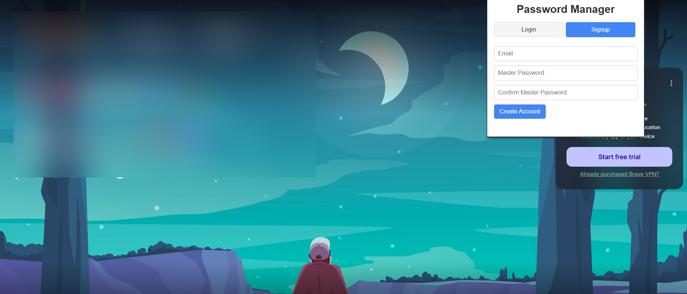
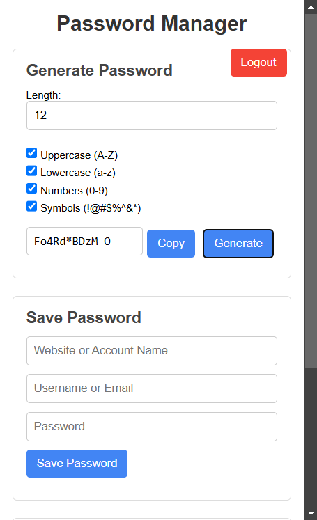
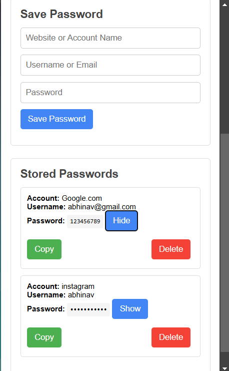

# SecureKey - Password Generator & Manager 🔐

## Overview
Do you often forget your passwords just like I do? 😵‍💫 If yes, then **SecureKey** is here to rescue you! 🚀 Store all your passwords securely in one place and generate strong passwords with ease.

SecureKey is a Chrome extension that not only generates strong passwords but also allows you to securely store them along with the associated accounts. With a user authentication system, only registered users can store and manage their passwords, ensuring maximum security.

## Preview 





## Features
✅ **Secure Password Generation**: Generate strong, random passwords effortlessly.  
✅ **Account Management**: Create an account and log in securely to manage your stored passwords.  
✅ **Store & Retrieve Passwords**: Save generated passwords along with account details in a secure database.  
✅ **User Authentication**: Only logged-in users can store and retrieve passwords.  
✅ **User-Friendly Interface**: Simple and intuitive design for easy navigation.  
✅ **Lightweight & Fast**: Minimal impact on browser performance.  

## Installation
1. Download or clone the repository.
2. Open **Google Chrome** and navigate to `chrome://extensions/`.
3. Enable **Developer Mode** (toggle in the top-right corner).
4. Click **Load Unpacked** and select the extension directory.
5. **Boom! 🎉 SecureKey is now installed and ready to use!**

## Usage
🛠️ **How to use SecureKey?**  
1. **Sign Up/Login** to access password management features.  
2. Use the **Generate Password** button to create a strong password.  
3. Save your password along with the associated account securely in the database.  
4. Retrieve your stored passwords anytime from the dashboard.  

## Permissions
🔒 **Why does SecureKey need permissions?**  
- **Storage**: To securely save and retrieve stored passwords.  
- **Authentication**: To manage user accounts securely.  

## File Structure
```plaintext
SecureKey/
├── icons/
│   ├── icon16.png
│   ├── icon48.png
│   ├── icon128.png
├── popup/
│   ├── popup.html
│   ├── popup.js
├── background/
│   ├── background.js
├── auth/
│   ├── login.js
│   ├── signup.js
│   ├── auth.js
├── manifest.json
```

## Contributing
💡 Have an idea to make SecureKey even better?

We welcome contributions! If you find a bug, have suggestions, or want to add a new feature, feel free to:

- Submit a pull request

- Report an issue

Your contributions are highly appreciated! 🚀